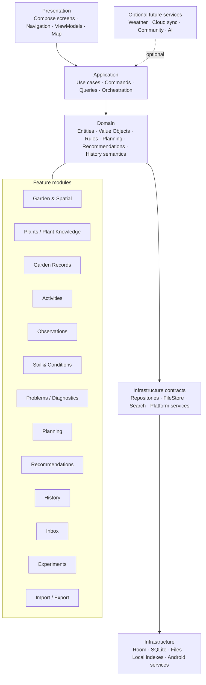
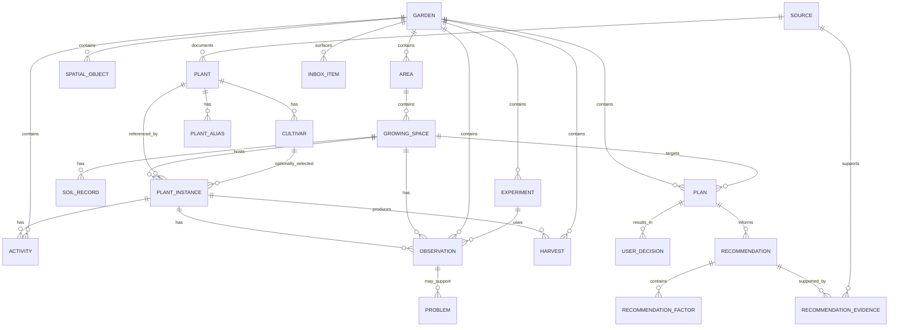

# Garden Planner & Manager — One-Page Architecture Overview

**Version:** 1.0 consolidated baseline | **Status:** Pre-development | **Date:** August 2026

## 1. Architecture diagram



## 2. Domain model / ERD



**Important semantic boundary:** `Plant` is general knowledge; `PlantInstance` is the user's actual plant. `Plan` is intent; `Activity` is actual occurrence. `Observation` is what was observed; `Problem`/diagnosis is an interpretation. `Recommendation` is derived; `UserDecision` is the user's choice.

## 3. Data-flow description

### Read / understand

`Room → Repository → Use Case → ViewModel → Compose`

Garden, plant, activity and historical data are read from the local database. Derived views may combine multiple authoritative records.

### Plan / recommend

`Garden + Space + Plant Knowledge + Conditions + History + Preferences → Recommendation Engine → Structured Recommendation → UI`

The engine does not write user facts. It produces suitability, confidence, factor results, evidence, missing information and explanations.

### Decide / act

`Recommendation/Plan → User Decision → Actual Activity → Outcome/Observation/Harvest → History`

An override is a valid user decision, not an application error.

### Import

`File → Parse → Validate → Conflict analysis → Preview → Confirm → Transaction → Repository → Room`

### Export

`Authoritative records → Validation/serialization → Versioned export file`

## 4. Architectural invariants

```text
User facts       = authoritative
Knowledge        = separate reference information
Recommendations  = derived
Plans            = intended future actions
Activities       = what actually happened
History          = durable record
Search/cache     = rebuildable
UI               = presentation, not business logic
```
